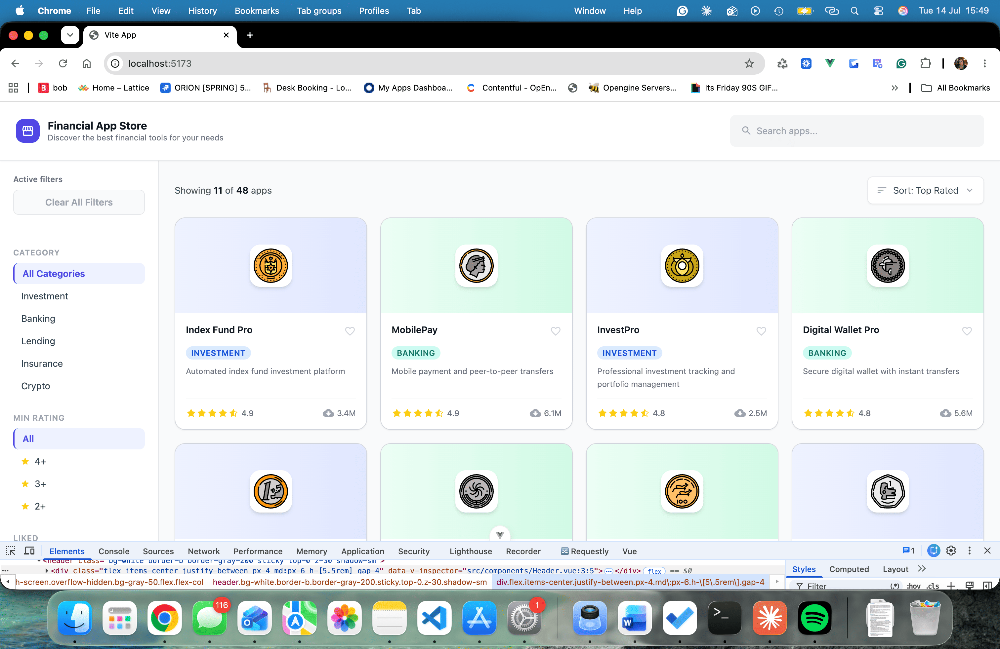
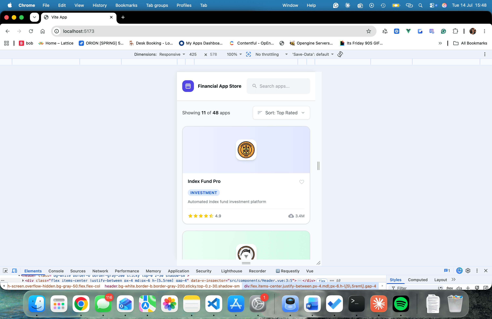

# my-app - # Financial App Store — Frontend Take Home Test

## Recommended IDE Setup

[VS Code](https://code.visualstudio.com/) + [Vue (Official)](https://marketplace.visualstudio.com/items?itemName=Vue.volar) (and disable Vetur).

## Project Setup

```bash
npm install
```

```bash
npm run dev
```

Open [http://localhost:5173]

## Screenshots of the finished app




## Tech Stack

- Vue - as more comfortable in Vue than React
- Styling - Tailwind - to help save time

## Icons & assets

Kept the icons consistent by using **Material Icons** for all icons
besides the provided **SVG assets**

## Use of AI to help save time

- For scaffolding, debugging, styling, and doing small tweaks to the styles to match the design
- Filter functionality, because I didn't have enough time

## What we're looking for

- ✅ How closely you've matched the provided design
- ✅ A layout that feels clean and easy to use
- ✅ Visible and intuitive filter interactions
- ✅ Readable, well-structured code
- ✅ Attention to small details — spacing, alignment, hover states
- ✅ Mobile-friendly layout - mostly done - just haven't added the filter burger icon/section on mobile as I ran out of time

## Additional features

- ✅ Optimised the SVG icons

## If I had more time

- Add the clear all Filters functionality
- Add working search
- Add working Sort button
- Mobile-friendly sidebar - filters
- Atomic Design folder structure - For Design/Engineer single source of truth -  though not needed here because it's a small app
- Unit tests
- Improve Accessibility
- Performance optimisation
- Build in React
- BEM
- Add comments to help other developers understand the code
- EsLint
- Error handling
